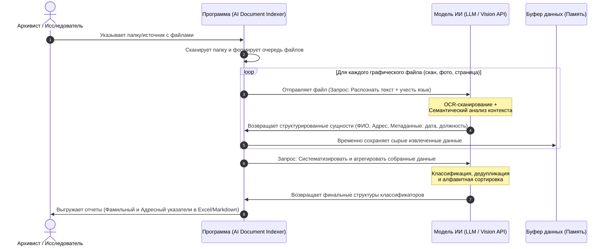

# ai-document-indexer
Составить адресный и фамильный индексы к спискам фотографий (содержащих адреса и ФИО) для ускорения и облегчения архивного поиска

## 📌 Проблема (Problem Statement)
Раньше до архивных документов нужно было физически доезжать. Сегодня миллионы страниц оцифрованы и выложены в сеть. Однако это породило новую проблему — **критический избыток неструктурированной информации**.

**В чем парадокс и главная боль:**
1. **«Слепые данные»:** Все открывшиеся источники — это терабайты графических изображений (фото, сканы книг, рукописи). Текст внутри них заблокирован. Поиск по ключевому слову (ФИО или городу) технически невозможен.
2. **Множитель ручного труда:** Поскольку документов стало в 100 раз больше, время на их ручную «вычитку» выросло пропорционально. Архивист тратит недели, просматривая сотни гигабайт картинок ради одной фамилии.
3. **Финансовые потери при нулевом КПД:** Доступ к базам сканов часто платный (поминутная тарификация или оплата за просмотр дела). Исследователь платит деньги за доступ, тратит дни на просмотр, но в итоге может выяснить, что нужной фамилии в источнике вообще не было. 
4. **Хаос вместо классификаторов:** Из-за отсутствия алфавитных указателей каждый новый исследователь вынужден заново, за свои деньги, вручную перечитывать одни и те же сканы.

## 🗺️ Архитектура процесса (System Workflow)

Ниже представлена UML-диаграмма последовательности, описывающая сквозной процесс обработки документов от выбора папки до генерации классификаторов:

