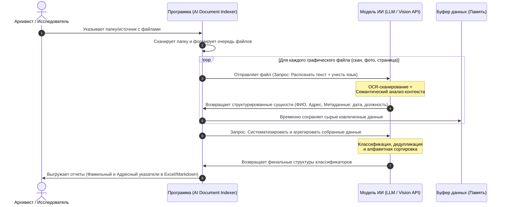

# ai-document-indexer
Составить адресный и фамильный индексы к спискам фотографий (содержащих адреса и ФИО) для ускорения и облегчения архивного поиска

## 📌 Проблема (Problem Statement)
Раньше до архивных документов нужно было физически доезжать. Сегодня миллионы страниц оцифрованы и выложены в сеть. Однако это породило новую проблему — **критический избыток неструктурированной информации**.

**В чем парадокс и главная боль:**
1. **«Слепые данные»:** Все открывшиеся источники — это терабайты графических изображений (фото, сканы книг, рукописи). Текст внутри них заблокирован. Поиск по ключевому слову (ФИО или городу) технически невозможен.
2. **Множитель ручного труда:** Поскольку документов стало в 100 раз больше, время на их ручную «вычитку» выросло пропорционально. Архивист тратит недели, просматривая сотни гигабайт картинок ради одной фамилии.
3. **Финансовые потери при нулевом КПД:** Доступ к базам сканов часто платный (поминутная тарификация или оплата за просмотр дела). Исследователь платит деньги за доступ, тратит дни на просмотр, но в итоге может выяснить, что нужной фамилии в источнике вообще не было. 
4. **Хаос вместо классификаторов:** Из-за отсутствия алфавитных указателей каждый новый исследователь вынужден заново, за свои деньги, вручную перечитывать одни и те же сканы.

## 🏗️ Архитектурные границы системы (System Architecture)
Для обеспечения максимальной доступности и удобства пользователей выбрана следующая целевая архитектура:

*   **Тип приложения:** Веб-приложение (Web App). Пользователю не нужно скачивать сложные программы или настраивать библиотеки на своем компьютере — всё работает через браузер.
*   **Входные данные:** Пользователь загружает файлы (или указывает локальную директорию/облачную папку в зависимости от ограничений безопасности браузера).
*   **Итоговый артефакт (Выходные данные):** Сгенерированный структурированный файл (например, формат Excel / `.xlsx` или `.csv`), который пользователь может скачать и сохранить в любую удобную папку на своем устройстве для дальнейшей локальной работы.

---

## 🎯 Критерии приемки и оценка качества (Acceptance Criteria & QA)
Проект считается успешным только в том случае, если автоматизированный ИИ-разбор не уступает по качеству работе эксперта-архивиста.

**Методология тестирования (Машинный vs Ручной разбор):**
1. Выбирается контрольная группа («слепой тест») — несколько сложных архивных файлов (сканов), которые ранее **не подавались** на вход ИИ.
2. **Ручной этап:** Профессиональный архивист вручную вычитывает эти файлы и составляет эталонные классификаторы (выписывает все ФИО, адреса, должности, даты). Этот результат принимается за 100% точности.
3. **Машинный этап:** Те же файлы отправляются на обработку в разрабатываемую программу `AI Document Indexer`.
4. **Сравнение результатов:** Проводится перекрестное сравнение двух классификаторов.

**Критерии успешности (Допуск к релизу):**
*   **Полнота извлечения данных (Recall):** ИИ должен обнаружить не менее **95%** сущностей (ФИО и адресов), найденных человеком. Пропуск фамилии критичен для генеалогии.
*   **Точность (Precision):** Количество "галлюцинаций" или ложноположительных срабатываний ИИ (когда случайное слово принято за фамилию) не должно превышать **5%**.
*   **Форматирование:** Итоговый файл успешно открывается в стандартных табличных редакторах без потери структуры данных и кодировки.

## 🗺️ Архитектура процесса (System Workflow)

Ниже представлена UML-диаграмма последовательности, описывающая сквозной процесс обработки документов от выбора папки до генерации классификаторов:

