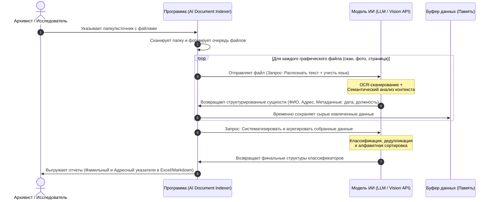

## 🗺️ Архитектура процесса (System Workflow)

Ниже представлена UML-диаграмма последовательности, описывающая сквозной процесс обработки документов от выбора папки до генерации классификаторов:

---

## 📥 Структура входных данных (Input Data Structure)
Система принимает на вход массив графических файлов (сканов). Веб-приложение считывает файлы и сохраняет их относительные пути к папкам на диске пользователя. 
Для каждого файла в конвейер ИИ передаются следующие метаданные:

| № | Название поля | Тип данных | Обязательность | Описание / Ограничения | Пример заполнения |
| :--- | :--- | :--- | :--- | :--- | :--- |
| 1 | `file_path` | String | Обязательное | Полный путь к файлу, включая имя корневой и вложенных папок | `/Archive_2026/Fund_12/Opis_3/Delo_45/scan_001.jpg` |
| 2 | `file_name` | String | Обязательное | Имя файла с расширением (выделяется из `file_path`) | `scan_001.jpg` |
| 3 | `target_language`| String | Обязательное | Языковой профиль для ИИ: `ru-modern` или `ru-old` (дореволюционный) | `ru-old` |

---

## 📤 Структура выходных данных и логика агрегации

Система спроектирована по принципу **Single Source of Truth (Единый источник истины)**. ИИ анализирует графический документ один раз и возвращает единый плоский массив данных. Веб-приложение принимает этот массив и автоматически формирует из него два разных табличных представления (отчёта) для пользователя, меняя лишь порядок колонок и логику сортировки.

### 📋 Единая структура данных (Сырой ответ ИИ)

Каждая запись в извлеченном ИИ массиве строго содержит следующие 5 атрибутов:
1. `FIO` (String) — ФИО лица в современной орфографии.
2. `Rank_Position` (String) — Должность, сословие или воинское звание.
3. `Locality` (String) — Связанный с лицом населенный пункт.
4. `Doc_Number` (String) — Номер документа / распоряжения / приказа.
5. `Doc_Date` (String) — Полная дата документа (включая день, месяц и год).

---

### 🗂️ Логика формирования финальных отчётов (Представления)

При экспорте в Excel программа берёт этот единый массив данных и генерирует два независимых файла формата `.xlsx`:

#### 1. 👥 Фамильный классификатор (`Фамильный_указатель.xlsx`)
* **Бизнес-цель:** Быстрый сквозной поиск информации по конкретному человеку.
* **Алгоритм сортировки:** Данные сортируются по алфавиту строго по колонке **`FIO`**.

| № | Название поля | Тип данных | Описание алгоритма заполнения | Пример заполнения |
| :--- | :--- | :--- | :--- | :--- |
| 1 | `FIO` | String | Извлеченное ИИ ФИО (или Фамилия и Инициалы) | `Иванов Петр Сергеевич` |
| 2 | `Rank_Position` | String | Должность или воинское звание лица | `Старший унтер-офицер` |
| 3 | `Locality` | String | Населенный пункт, связанный с лицом в документе | `с. Петровское` |
| 4 | `Doc_Number` | String | Номер документа / распоряжения / приказа | `№ 5` |
| 5 | `Doc_Date` | String | Полная дата документа (включая день, месяц и год) | `10.05.1915` |

#### 2. 🗺️ Адресный классификатор (`Адрес_указатель.xlsx`)
* **Бизнес-цель:** Сквозной поиск по географическим объектам (связи людей и документов с местом).
* **Алгоритм сортировки:** Программа переставляет географию на первое место и сортирует строки по алфавиту по колонке **`Locality`**.

| № | Название поля | Тип данных | Описание алгоритма заполнения | Пример заполнения |
| :--- | :--- | :--- | :--- | :--- |
| 1 | `Locality` | String | Населенный пункт (город, село, деревня, хутор) | `с. Петровское` |
| 2 | `FIO` | String | ФИО лица, упомянутого в связи с этим местом | `Иванов Петр Сергеевич` |
| 3 | `Rank_Position` | String | Должность или воинское звание указанного лица | `Старший унтер-офицер` |
| 4 | `Doc_Number` | String | Номер документа / распоряжения / приказа | `№ 5` |
| 5 | `Doc_Date` | String | Полная дата документа (включая день, месяц и год) | `10.05.1915` |

