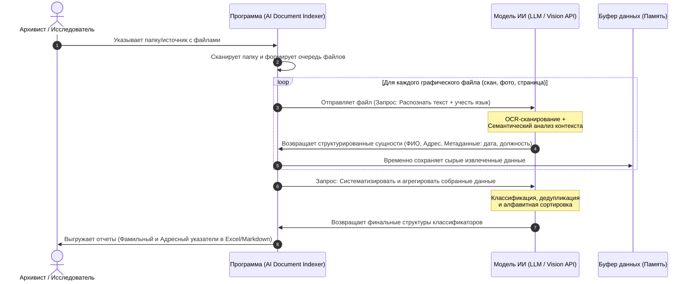

## 🗺️ Архитектура процесса (System Workflow)

Ниже представлена UML-диаграмма последовательности, описывающая сквозной процесс обработки документов от выбора папки до генерации классификаторов:

---

## 🗃️ Спецификация данных
Детальное описание полей, типов данных, обязательности и примеров заполнения вынесено в отдельный документ:
👉 **[Модель данных (Data Model)](data-model.md)**

