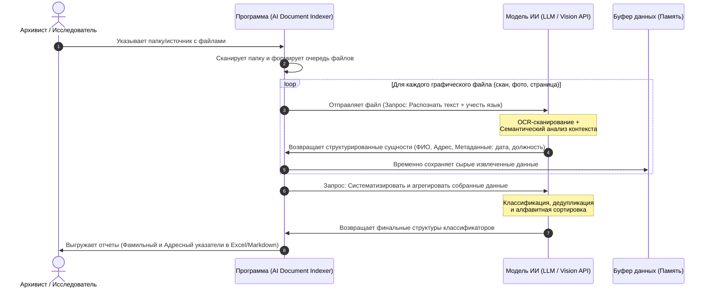

## 🗺️ Архитектура процесса (System Workflow)

Ниже представлена UML-диаграмма последовательности, описывающая сквозной процесс обработки документов от выбора папки до генерации классификаторов:

---

## 📥 Структура входных данных (Input Data Structure)
Система принимает на вход массив графических файлов (сканов). Веб-приложение считывает файлы и сохраняет их относительные пути к папкам на диске пользователя. 
Для каждого файла в конвейер ИИ передаются следующие метаданные:

| № | Название поля | Тип данных | Обязательность | Описание / Ограничения | Пример заполнения |
| :--- | :--- | :--- | :--- | :--- | :--- |
| 1 | `file_path` | String | Обязательное | Полный путь к файлу, включая имя корневой и вложенных папок | `/Archive_2026/Fund_12/Opis_3/Delo_45/scan_001.jpg` |
| 2 | `file_name` | String | Обязательное | Имя файла с расширением (выделяется из `file_path`) | `scan_001.jpg` |
| 3 | `target_language`| String | Обязательное | Языковой профиль для ИИ: `ru-modern` или `ru-old` (дореволюционный) | `ru-old` |

---

## 📥 Структура входных данных (Input Data Structure)

Система принимает на вход массив графических файлов (сканов). Веб-приложение считывает файлы и сохраняет их относительные пути к папкам на диске пользователя. 

Для каждого файла в конвейер обработки передаются следующие метаданные:

| № | Название поля | Тип данных | Обязательность | Описание / Ограничения | Пример заполнения |
| :--- | :--- | :--- | :--- | :--- | :--- |
| 1 | `file_path` | String | Обязательное | Полный путь к файлу, включая имя корневой и вложенных папок | `/Archive_2026/Fund_12/Opis_3/Delo_45/scan_001.jpg` |
| 2 | `file_name` | String | Обязательное | Имя файла с расширением (выделяется из `file_path`) | `scan_001.jpg` |
| 3 | `target_language`| String | Обязательное | Языковой профиль для ИИ: `ru-modern` или `ru-old` (дореволюционный) | `ru-old` |

---

## 📤 Результирующая структура: Фамильно-Адресный классификатор

Конечной целью этапа обработки является формирование **единого консолидированного классификатора (Single Source of Truth)**. ИИ анализирует графический документ один раз и возвращает плоский массив объектов. Программа последовательно агрегирует эти данные из всех файлов в единую результирующую матрицу.

Каждая запись в итоговом классификаторе строго содержит следующие 5 атрибутов:

| № | Название поля | Тип данных | Ключевое поле | Описание алгоритма заполнения | Пример заполнения |
| :--- | :--- | :--- | :--- | :--- | :--- |
| 1 | `FIO` | String | Да | Извлеченное ИИ ФИО (или Фамилия и Инициалы), приведенное к современной орфографии | `Иванов Петр Сергеевич` |
| 2 | `Rank_Position` | String | Нет | Должность, сословие или воинское звание лица, упомянутое в документе | `Старший унтер-офицер` |
| 3 | `Locality` | String | Да | Населенный пункт (город, село, деревня, хутор), связанный с лицом в документе | `с. Петровское` |
| 4 | `Doc_Number` | String | Нет | Номер документа / распоряжения / архивного приказа | `№ 5` |
| 5 | `Doc_Date` | String | Нет | Полная дата документа (включая день, месяц и год) | `10.05.1915` |

*Примечание: Логика генерации пользовательских отчетов (представлений) на основе этого классификатора будет вынесена в отдельный компонент системы и в данном документе не описывается.*

