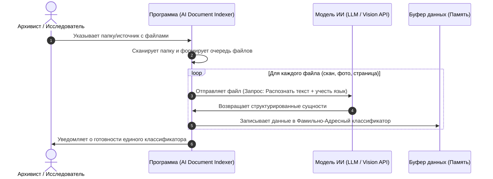
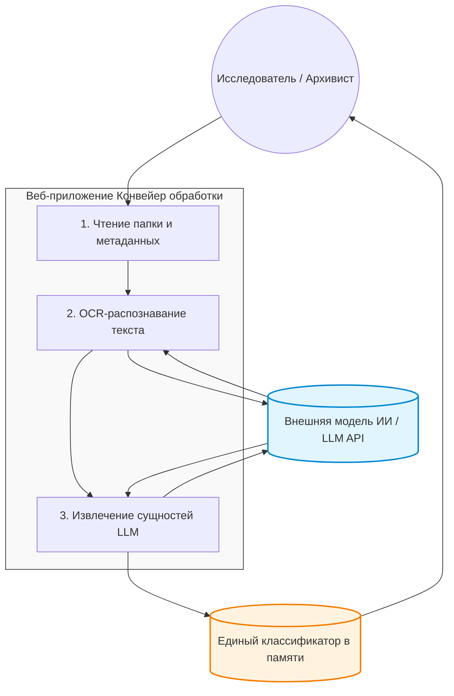

# Архитектура системы (System Architecture)

В данном документе описано техническое взаимодействие компонентов системы и процессы трансформации данных.

---

## 🗺️ Сценарий взаимодействия (System Workflow)

Ниже представлена UML-диаграмма последовательности, описывающая сквозной процесс обработки документов от выбора папки до генерации классификатора:

---

## 🔄 Диаграмма потоков данных (Data Flow Diagram - DFD)

DFD-диаграмма уровня 1 описывает, как данные трансформируются в системе и собираются в единый источник истины:

---

## 🛡️ Стратегия сохранения состояния и защита от перезагрузки (F5 Resilience)

Для предотвращения потери данных и прогресса обработки при случайном или намеренном обновлении страницы пользователем (нажатие F5/Reload), система реализует архитектурный шаблон **«Толстый локальный бэкенд» (Local Backend State Management)**.

### Механизм работы:
1. **Разделение контуров:** 
   * **Фронтенд (Браузер):** Отвечает исключительно за отображение интерфейса, прогресс-бара и таблиц. Не хранит в себе состояние конвейера.
   * **Бэкенд (Локальный сервер):** Работает как независимый фоновый процесс на компьютере пользователя. Именно он хранит очередь файлов, промежуточный буфер данных и текущий статус обработки.
2. **Восстановление после F5:** 
   * При обновлении страницы в браузере соединение разрывается, но фоновый процесс бэкенда **не останавливает** конвейер обработки и продолжает опрашивать ИИ.
   * После перезагрузки фронтенд при старте отправляет на бэкенд запрос `GET /api/status`.
   * Бэкенд возвращает текущую точку прогресса (например, *«Файл 45 из 100, статус: В процессе»*).
   * Интерфейс мгновенно восстанавливает положение прогресс-бара и логов без потери данных.
3. **Отказоустойчивость буфера:** Каждая успешно извлеченная ИИ запись сразу записывается бэкендом в энергонезависимый промежуточный буфер (локальный JSON/SQLite файл на диске), что защищает данные даже при внезапном отключении питания компьютера.

---

## 🗃️ Спецификация данных
Детальное описание полей, типов данных, обязательности и примеров заполнения вынесено в отдельный документ:
👉 **[Модель данных (Data Model)](data-model.md)**
