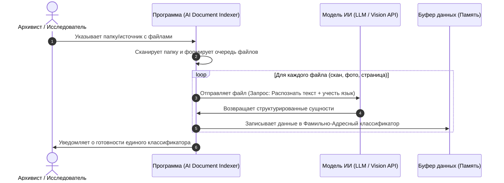

# Архитектура системы (System Architecture)

В данном документе описано техническое взаимодействие компонентов системы и процессы трансформации данных.

---

## 🗺️ Сценарий взаимодействия (System Workflow)

Ниже представлена UML-диаграмма последовательности, описывающая сквозной процесс обработки документов от выбора папки до генерации классификатора:



---

## 🔄 Диаграмма потоков данных (Data Flow Diagram - DFD)

DFD-диаграмма уровня 1 описывает, как данные трансформируются в системе и собираются в единый источник истины:

```mermaid
graph TD
    User((Исследователь / Архивист))
    
    subgraph Web_App [Веб-приложение (Конвейер обработки)]
        P1[1. Чтение папки и метаданных]
        P2[2. OCR-распознавание текста]
        P3[3. Извлечение сущностей LLM]
    end
    
    AI[(Внешняя модель ИИ / LLM API)]
    DB[(Единый классификатор в памяти)]
    
    User -->|Путь к папке и выбор языка| P1
    P1 -->|Массив метаданных| P2
    P2 -->|Графический поток| AI
    AI -->|Сырой текстовый слой| P2
    P2 -->|Текст документа| P3
    P3 -->|Запрос: извлечение по 5 полям| AI
    AI -->|Валидный JSON-массив| P3
    P3 -->|Структурированные записи (5 полей)| DB
    
    DB -->|Выгрузка Фамильно-Адресного классификатора| User

    style Web_App fill:#f9f9f9,stroke:#333,stroke-width:1px
    style AI fill:#e1f5fe,stroke:#0288d1,stroke-width:2px
    style DB fill:#fff3e0,stroke:#f57c00,stroke-width:2px
```

---

## 🗃️ Спецификация данных
Детальное описание полей, типов данных, обязательности и примеров заполнения вынесено в отдельный документ:
👉 **[Модель данных (Data Model)](data-model.md)**
