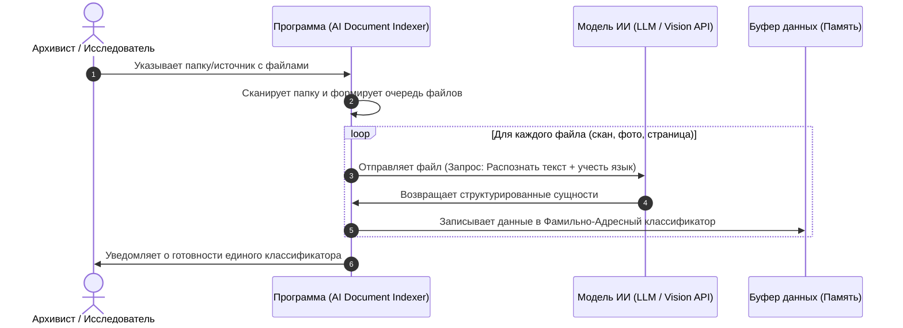
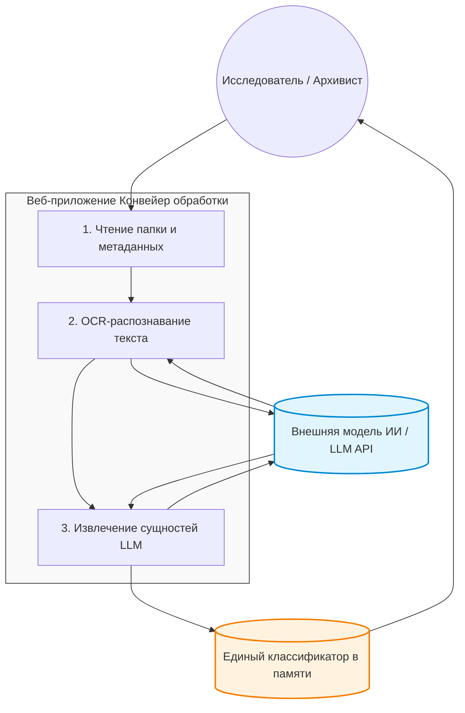

# Архитектура системы (System Architecture)

В данном документе описано техническое взаимодействие компонентов системы и процессы трансформации данных.

---

## 🗺️ Сценарий взаимодействия (System Workflow)

Ниже представлена UML-диаграмма последовательности, описывающая сквозной процесс обработки документов от вызова пользователя до формирования единого классификатора:



---

## 🔄 Диаграмма потоков данных (Data Flow Diagram - DFD)

DFD-диаграмма уровня 1 описывает, как данные трансформируются в системе и собираются в единый источник истины:



---

## 💻 Пример реального кода: Модуль сканера директорий

Ниже представлен краткий фрагмент из `src/scanner.py`, иллюстрирующий, как реализуется ключевой компонент архитектуры:

```python
from pathlib import Path
from typing import List, Dict

class ArchivalDocumentScanner:
    """Сканер локальной директории с поддержкой F5-восстановления"""
    
    def __init__(self, target_language: str = "ru-old"):
        self.target_language = target_language
        self.allowed_extensions = {".jpg", ".jpeg", ".png", ".tiff"}
        self.load_security_keys()  # Безопасная загрузка из .env
    
    def scan_directory(self, folder_path_str: str) -> List[Dict[str, str]]:
        """Рекурсивное сканирование папки и сбор метаданных для ИИ-обработки"""
        folder_path = Path(folder_path_str)
        
        if not folder_path.exists():
            raise FileNotFoundError(f"Папка не найдена: {folder_path_str}")
        
        metadata_queue = []
        
        # Рекурсивный обход всех файлов в подпапках
        for file in folder_path.rglob("*"):
            if file.is_file() and file.suffix.lower() in self.allowed_extensions:
                metadata_queue.append({
                    "file_path": str(file.resolve()),
                    "file_name": file.name,
                    "target_language": self.target_language
                })
        
        return metadata_queue if metadata_queue else []
```

**Ключевые особенности:**
- Использует `pathlib` (Python 3.10+) для кроссплатформенной работы с путями
- Безопасная загрузка API-ключа Gemini из `.env` (см. `/docs/security-policy.md`)
- Обработка edge cases: пустая папка, поврежденные файлы, неверный путь (возвращает пустой список вместо критической ошибки)

Полный исходный код модуля доступен в [`src/scanner.py`](../src/scanner.py).

---

## 🛡️ Стратегия сохранения состояния и защита от перезагрузки (F5 Resilience)

Для предотвращения потери данных и прогресса обработки при случайном или намеренном обновлении страницы пользователем (нажатие F5) реализован механизм восстановления состояния.

### Механизм работы:

#### 1. Разделение контуров (Client-Server Separation)

* **Фронтенд (браузер):** Отвечает исключительно за отображение интерфейса, прогресс-бара и таблиц. Не хранит состояние обработки и не кэширует результаты ИИ-обработки.
* **Бэкенд (Локальный сервер):** Работает как независимый фоновый процесс на компьютере пользователя. Именно здесь сохраняется состояние сессии (какой файл обрабатывается, какие записи уже извлечены, текущий прогресс).

#### 2. Восстановление после F5

Когда пользователь нажимает F5 (обновляет страницу):

1. **Браузер перезагружается,** соединение разрывается
2. **Бэкенд продолжает работу независимо** (фоновый процесс не останавливается)
3. **После перезагрузки фронтенд отправляет запрос** `GET /api/status?session_id=<уникальный_id>`
4. **Бэкенд возвращает текущее состояние:**
   - Количество обработанных файлов
   - Текущий файл, если обработка еще идет
   - Полученные на данный момент записи из классификатора
   - Перечень ошибок, если есть
5. **Интерфейс мгновенно восстанавливает положение прогресс-бара и логов** без потери данных

#### 3. Отказоустойчивость буфера и хранилище состояния

- Каждая успешно извлеченная ИИ-запись **немедленно записывается** на бэкенде
- Сессионное состояние хранится либо в памяти (для быстрого восстановления), либо в локальной БД SQLite
- При критической ошибке бэкенд может также сохранить состояние в `.json` файл для дальнейшего восстановления

#### 4. Точки расширения: как добавить F5-восстановление для новых компонентов

Если вы добавляете новый асинхронный процесс:

1. **Регистрируйте процесс в сессии** (session registry) при старте
2. **Сохраняйте контрольные точки прогресса** после каждого успешного шага
3. **При восстановлении проверьте последнюю контрольную точку** и возобновите работу с нее
4. **Обновите эндпоинт `GET /api/status`** чтобы он возвращал состояние вашего процесса

Пример структуры сессии:
```json
{
  "session_id": "abc123def456",
  "start_time": "2026-05-20T10:30:00Z",
  "status": "processing",
  "total_files": 150,
  "processed_files": 47,
  "current_file": "scan_047.jpg",
  "extracted_records": [...],
  "errors": [...]
}
```

---

## 🔗 Как расширить архитектуру системы

### Сценарий 1: Добавление нового формата файлов (например, `.pdf`)

1. Откройте `src/scanner.py`
2. В конструкторе `ArchivalDocumentScanner` добавьте расширение в `allowed_extensions`:
   ```python
   self.allowed_extensions = {".jpg", ".jpeg", ".png", ".tiff", ".pdf"}
   ```
3. Убедитесь, что новый обработчик формата поддерживается в `src/gemini_client.py`
4. Протестируйте сканирование с новым форматом

### Сценарий 2: Добавление нового языкового профиля (например, `en-old` для английского)

1. Обновите валидацию в основном модуле приложения
2. В `src/scanner.py` добавьте новый профиль в документацию
3. Передайте новый параметр `target_language` в Gemini API
4. Тестируйте на документах на новом языке

### Сценарий 3: Подключение новой модели ИИ вместо Gemini

1. Создайте новый модуль (например, `src/openai_client.py`)
2. Реализуйте интерфейс, совместимый с текущим `GeminiArchivalParser`
3. Обновите `src/main.py` для выбора нужного провайдера
4. Это не потребует изменений в архитектуре сканера

---

## 📖 Глоссарий основных терминов

| Термин | Определение |
|---|---|
| **Сканер** | Компонент, который рекурсивно обходит файловую систему и собирает метаданные о найденных файлах поддерживаемых форматов. |
| **Источник данных** | Локальная папка, указанная пользователем, содержащая архивные документы в виде изображений или PDF. |
| **Индекс** | Единый структурированный классификатор (таблица), содержащий извлеченные ИИ-системой данные: ФИО, должности, местности, номера и даты документов. |
| **Графический файл** | Файл одного из поддерживаемых форматов (`.jpg`, `.png`, `.tiff`, `.pdf`), содержащий отсканированный архивный документ. |
| **F5-устойчивость** | Способность системы восстанавливать процесс обработки без потери данных при обновлении страницы браузера пользователем. |
| **Конвейер обработки** | Сквозной процесс: сканирование → отправка в ИИ → извлечение данных → агрегация в классификатор. |
| **Сессия** | Уникальный идентификатор и состояние одного сеанса обработки документов, сохраняемое на бэкенде для восстановления. |
| **Метаданные файла** | Структурированная информация о файле (путь, имя, языковой профиль), передаваемая в ИИ-модель для обработки. |
| **ДДЗ (Definition of Done)** | Критерии завершённости работы, определяющие, когда компонент считается готовым к интеграции. |
| **Edge Case** | Граничный случай, нестандартная ситуация (пустая папка, поврежденный файл, недоступный путь), которую система должна корректно обработать. |

---

## 📚 Ссылки на детали архитектуры

👉 **[Пользовательские истории (User Stories)](user-stories.md)** — функциональные требования к системе  
👉 **[Модель данных (Data Model)](data-model.md)** — структуры входных и выходных данных  
👉 **[Политика безопасности (Security Policy)](security-policy.md)** — требования к безопасности и управлению ключами
