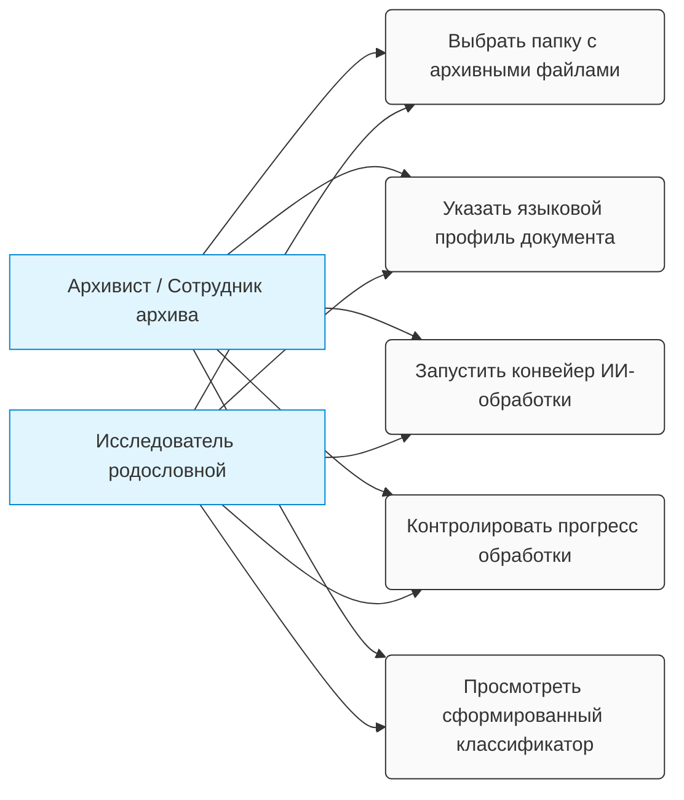

## 🗺️ Карта вариантов использования (Use Case Diagram)

Ниже представлена диаграмма, визуализирующая границы системы и основные сценарии взаимодействия конечных пользователей с приложением `AI Document Indexer`:

