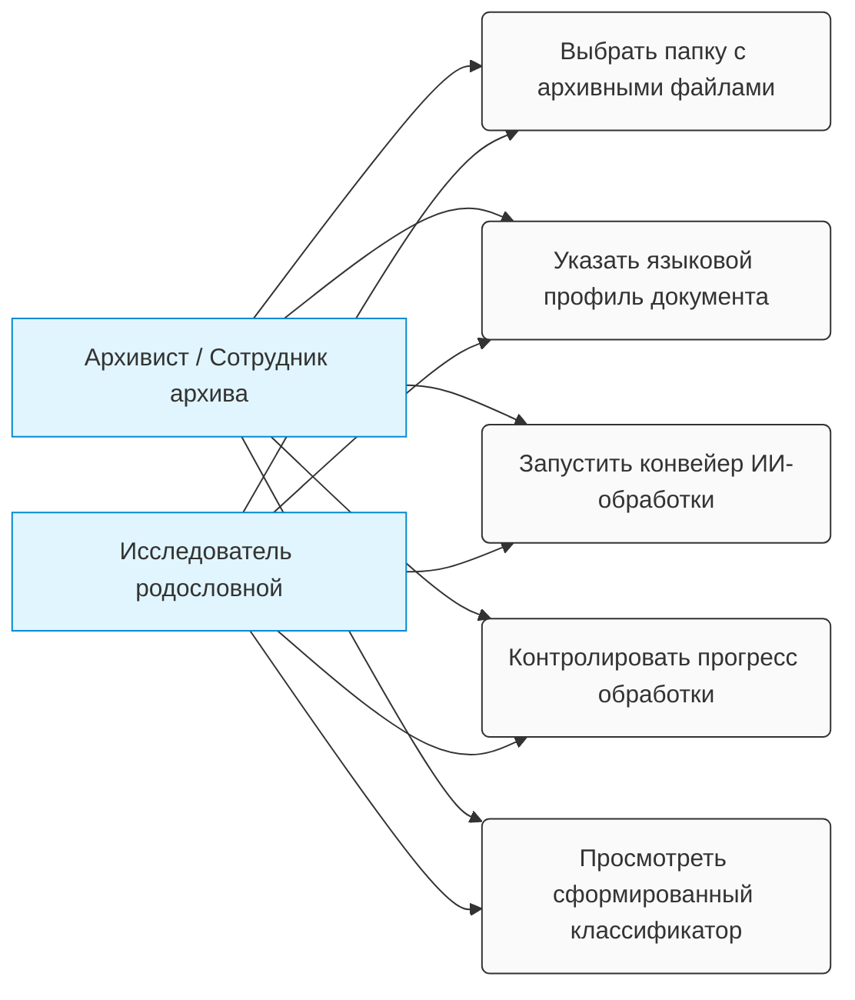

## 🗺️ Карта вариантов использования (Use Case Diagram)

Ниже представлена диаграмма, визуализирующая границы системы и основные сценарии взаимодействия конечных пользователей и системы `AI Document Indexer`.

---

# Пользовательские истории (User Stories) и критерии приёмки

В данном документе зафиксированы функциональные требования к системе `AI Document Indexer` со стороны конечного пользователя. Каждая user story сопровождается явными критериями приёмки и чек-листом Definition of Done.

---

## 👥 Бэклог пользовательских историй (User Stories)

### 1. Авторизация и старт работы

* **Роль:** Исследователь родословной / Сотрудник архива
* **История:** Я как исследователь хочу открыть приложение и ознакомиться с главным интерфейсом, чтобы начать работу по созданию классификатора архивных документов.
* **Критерии приёмки (AC):**
  - **AC 1.1:** При запуске приложения открывается главный экран с понятной навигацией и логотипом проекта.
  - **AC 1.2:** На главном э��ране отображается краткая справка или приветственное окно с инструкцией для новых пользователей.
  - **AC 1.3:** Доступны кнопки для перехода к основным функциям: «Выбрать папку», «Загрузить существующий проект», «Параметры».

* **Definition of Done:**
  - [ ] Главное окно приложения открывается без ошибок
  - [ ] Элементы интерфейса корректно выравниваются на экранах разных размеров (1024x768 и выше)
  - [ ] Справка доступна в интерактивном или текстовом виде
  - [ ] Unit-тесты покрывают инициализацию приложения (coverage ≥ 80%)
  - [ ] Документация обновлена с описанием главного экрана

---

### 2. Выбор источника данных

* **Роль:** Исследователь родословной / Сотрудник архива
* **История:** Я как исследователь хочу выбрать папку на локальном компьютере, чтобы указать с��стеме, где находятся архивные документы, которые нужно обработать.
* **Критерии приёмки (AC):**
  - **AC 2.1:** В интерфейсе доступна кнопка «Обзор» / «Выбрать папку» для вызова стандартного диалогового окна операционной системы.
  - **AC 2.2:** После выбора папки система отображает полный путь к ней на экране (например, `/Users/user/Archive_2026/Fund_12`).
  - **AC 2.3:** Система проверяет доступность выбранной папки перед началом сканирования; если папка недоступна или не существует, выводится ошибка с рекомендацией.
  - **AC 2.4:** При выборе пустой папки или папки без файлов поддерживаемых форматов система выводит информационное сообщение.

* **Definition of Done:**
  - [ ] Диалоговое окно открывается корректно для всех поддерживаемых ОС (Windows, macOS, Linux)
  - [ ] Валидация пути работает для всех edge case (специальные символы, длинные пути, UNC-пути на Windows)
  - [ ] Обработка ошибок с понятными сообщениями пользователю
  - [ ] Написаны unit-тесты для функции валидации пути (coverage ≥ 85%)
  - [ ] Интеграционный тест для выбора папки через диалоговое окно ОС

---

### 3. Настройка параметров поиска и обработки

* **Роль:** Исследователь родословной / Сотрудник архива
* **История:** Я как исследователь хочу настроить параметры обработки документов (выбрать расширения файлов, указать эпоху и орфографию), чтобы система корректно распознавала и обрабатывала документы нужного мне типа.
* **Критерии приёмки (AC):**
  - **AC 3.1:** Доступен выбор форматов файлов через чекбоксы или список: `.jpg`, `.png`, `.tiff`, `.pdf`.
  - **AC 3.2:** Доступен выбор языкового профиля эпохи (дропдаун или переключатель):
    - `ru-old` — для дореволюционных документов (дореформенная орфография)
    - `ru-soviet` — для советских документов
    - `ru-modern` — для современных документов (по умолчанию)
  - **AC 3.3:** Параметры сохраняются как профиль и могут быть применены повторно для похожих наборов документов.
  - **AC 3.4:** При изменении параметров фронтенд показывает превью: сколько файлов будет обработано после применения фильтра.

* **Definition of Done:**
  - [ ] Интерфейс настроек открывается и закрывается без ошибок
  - [ ] Выбранные параметры сохраняются в сессию (в памяти) или в локальн��е хранилище браузера
  - [ ] Профили сохраняются и загружаются корректно (JSON-формат или аналогично)
  - [ ] Unit-тесты для логики фильтрации файлов по расширениям (coverage ≥ 90%)
  - [ ] Документация API с описанием параметров запроса

---

### 4. Запуск конвейера обработки

* **Роль:** Исследователь родословной / Сотрудник архива
* **История:** Я как исследователь хочу запустить процесс обработки документов одним нажатием кнопки, чтобы система автоматически отсканировала файлы, распознала текст и сформировала классификатор.
* **Критерии приёмки (AC):**
  - **AC 4.1:** Кнопка «Начать обработку» / «Start» активна только после выбора папки и подтверждения параметров.
  - **AC 4.2:** При нажатии кнопки фронтенд отправляет запрос на бэкенд с параметрами: `folder_path`, `file_extensions`, `document_script_era`.
  - **AC 4.3:** Бэкенд запускает асинхронный процесс сканирования и обработки; фронтенд получает `session_id` для отслеживания прогресса.
  - **AC 4.4:** Процесс обработки продолжает работу в фоне, даже если пользователь закроет браузер (F5 Resilience).

* **Definition of Done:**
  - [ ] API endpoint `POST /api/process` разработан и протестирован
  - [ ] Сессия сохраняется на бэкенде с сохранением состояния (в памяти или БД)
  - [ ] Асинхронная обработка реализована без блокирования основного потока
  - [ ] Unit-тесты для валидации входных параметров (coverage ≥ 85%)
  - [ ] Интеграционный тест: запуск → получение session_id → проверка статуса
  - [ ] Документация API и примеры curl/JavaScript запросов

---

### 5. Мониторинг прогресса обработки

* **Роль:** Исследователь родословной / Сотрудник архива
* **История:** Я как исследователь хочу отслеживать текущее состояние обработки документов (какой файл обрабатывается, сколько завершено, примерное время до конца), чтобы понимать прогресс работы.
* **Критерии приёмки (AC):**
  - **AC 5.1:** На экране отображается визуальный прогресс-бар (0–100%) с актуальным процентом завершения.
  - **AC 5.2:** Выводится текстовая информация: имя текущего обрабатываемого файла и счетчик (например, *«Обработано 15 из 120 файлов»*).
  - **AC 5.3:** Система рассчитывает и выводит ориентировочное время до завершения (ETA), обновляемое каждые 2–3 секунды.
  - **AC 5.4:** При обновлении страницы (F5) прогресс восстанавливается из ответа сервера; процесс не прерывается и не теряется.

* **Definition of Done:**
  - [ ] API endpoint `GET /api/status?session_id=<id>` разработан и возвращает актуальный статус
  - [ ] Фронтенд отправляет запрос на статус каждые 1–2 секунды и обновляет визуальные элементы
  - [ ] Прогресс-бар плавно анимируется, не мигает (CSS transitions)
  - [ ] ETA рассчитывается корректно на основе среднего времени обработки одного файла
  - [ ] Unit-тесты для функции расчета ETA (coverage ≥ 80%)
  - [ ] Интеграционный тест: F5 → восстановление прогресса из session_id
  - [ ] Документация в README о механизме F5 Resilience

---

### 6. Контроль и разбор ошибок

* **Роль:** Исследователь родословной / Сотрудник архива
* **История:** Я как исследователь хочу увидеть ошибки и проблемы при обработке документов (поврежденные файлы, ошибки распознавания), чтобы иметь возможность их проанализировать и повторно обработать при необходимости.
* **Критерии приёмки (AC):**
  - **AC 6.1:** Поврежденные или нечитаемые файлы не прерывают работу всей программы; обработка продолжается со следующего файла.
  - **AC 6.2:** В конце сессии формируется наглядный список проблемных файлов с указанием путей, причин ошибок и рекомендаций.
  - **AC 6.3:** Пользователь может экспортировать log-файл ошибок в `.txt` или `.csv` для анализа.
  - **AC 6.4:** Для каждой ошибки система предлагает возможность повторной обработки (retry).

* **Definition of Done:**
  - [ ] Обработка исключений реализована для всех критических операций (чтение файла, обращение к API, парсинг)
  - [ ] Error log структурирован и содержит: timestamp, file_path, error_code, error_message, suggested_action
  - [ ] Unit-тесты для функций обработки ошибок (coverage ≥ 90%)
  - [ ] Интеграционный тест: обработка папки с поврежде��ными файлами → проверка error log
  - [ ] Функция экспорта логов работает корректно (CSV с разделителями, кодировка UTF-8)
  - [ ] Написан гайд пользователя: «Как интерпретировать и исправлять ошибки»

---

### 7. Просмотр сформированного классификатора

* **Роль:** Исследователь родословной / Сотрудник архива
* **История:** Я как исследователь хочу просмотреть результирующий классификатор (таблицу с ФИ, должностями, локациями, датами из документов), чтобы убедиться в корректности распознавания и внести необходимые исправления.
* **Критерии приёмки (AC):**
  - **AC 7.1:** После завершения обработки на экране отображается интерактивная таблица с итоговыми данными классификатора.
  - **AC 7.2:** Таблица содержит колонки согласно структуре из `/docs/data-model.md`: `FIO`, `Rank_Position`, `Locality`, `Doc_Number`, `Doc_Date`.
  - **AC 7.3:** В таблице реализована сортировка по каждому столбцу и фильтрация по ключевым словам.
  - **AC 7.4:** Пользователь может редактировать ячейки таблицы вручную (inline edit) для исправления ошибок распознавания.

* **Definition of Done:**
  - [ ] Компонент таблицы работает корректно с >= 10 000 строк без снижения производительности
  - [ ] Реализована пагинация или виртуальный скролл (virtual scrolling)
  - [ ] Сортировка и фильтрация работают по всем колонкам
  - [ ] Inline edit функция сохраняет изменения в памяти или в БД
  - [ ] Unit-тесты для логики сортировки и фильтрации (coverage ≥ 85%)
  - [ ] Интеграционный тест: просмотр, сортировка, редактирование, сохранение
  - [ ] Документация с описанием полей классификатора

---

### 8. Экспорт и сохранение классификатора

* **Роль:** Исследователь родословной / Сотрудник архива
* **История:** Я как исследователь хочу сохранить итоговый сформированный классификатор в различных форматах (JSON, CSV, Excel), чтобы использовать его в других приложениях или поделиться с коллегами.
* **Критерии приёмки (AC):**
  - **AC 8.1:** На экране доступна кнопка «Экспорт» / «Сохранить результат» с дропдаун-меню выбора формата.
  - **AC 8.2:** Поддерживаемые форматы экспорта: `.json`, `.csv`, `.xlsx` (Excel).
  - **AC 8.3:** Система позволяет пользователю через диалоговое окно выбрать целевую папку и имя сохраняемого файла.
  - **AC 8.4:** После успешного экспорта выводится уведомление с указанием пути сохранённого файла и возможностью открыть папку.

* **Definition of Done:**
  - [ ] API endpoint `POST /api/export` разработан и подде��живает все форматы
  - [ ] Экспорт в JSON работает корректно с кириллицей (UTF-8 кодировка)
  - [ ] Экспорт в CSV соответствует стандарту RFC 4180, кодировка UTF-8 с BOM для Excel
  - [ ] Экспорт в XLSX использует корректные типы данных и форматирование
  - [ ] Unit-тесты для каждого формата экспорта (coverage ≥ 80%)
  - [ ] Интеграционный тест: процесс сканирования → экспорт → проверка файла
  - [ ] Документация с примерами экспортированных файлов

---

### 9. Обновление программного обеспечения

* **Роль:** Исследователь родословной / Сотрудник архива
* **История:** Я как исследователь хочу иметь возможность легко обновить программу при выходе новой версии, чтобы использовать новые функции и исправления ошибок.
* **Критерии приёмки (AC):**
  - **AC 9.1:** Приложение содержит встроен��ый механизм проверки обновлений (например, кнопка «Проверить обновления» в меню).
  - **AC 9.2:** При наличии новой версии система выводит уведомление с описанием изменений (changelog).
  - **AC 9.3:** Процесс обновления прост и понятен: одно нажатие кнопки или скачивание инсталлера.

* **Definition of Done:**
  - [ ] Функция проверки версии реализована
  - [ ] Версионирование следует семантическому подходу (semver: major.minor.patch)
  - [ ] Changelog ведётся и отображается в приложении
  - [ ] Тестирование обновления в изолированной среде
  - [ ] Документация по процессу обновления для пользователя

---

## 📊 Матрица соответствия (Traceability Matrix)

| User Story | Архивист | Исследователь | Функциональность | Приоритет | Зависимости |
|---|---|---|---|---|---|
| 1. Авторизация и старт работы | ✓ | ✓ | UI/UX | Высокий | — |
| 2. Выбор источника данных | ✓ | ✓ | Сканирование FS | Высокий | #1 |
| 3. Настройка параметров | ✓ | ✓ | Фильтрация | Средний | #2 |
| 4. Запуск конвейера | ✓ | ✓ | Обработка ИИ | Высокий | #2, #3 |
| 5. Мониторинг прогресса | ✓ | ✓ | Визуализация | Средний | #4 |
| 6. Контроль ошибок | ✓ | ✓ | Обработка ошибок | Высокий | #4 |
| 7. Просмотр классификатора | ✓ | ✓ | Таблица данных | Высокий | #4, #6 |
| 8. Экспорт результатов | ✓ | ✓ | Интеграция | Средний | #7 |
| 9. Обновление ПО | ✓ | ✓ | Поддержка | Низкий | — |

---

## 📚 Ссылки на архитектуру

👉 **[Архитектура системы (System Architecture)](architecture.md)** — детали реализации и взаимодействия компонентов  
👉 **[Модель данных (Data Model)](data-model.md)** — структуры входных и выходных данных  
👉 **[Политика безопасности (Security Policy)](security-policy.md)** — тр��бования к безопасности и управлению ключами
