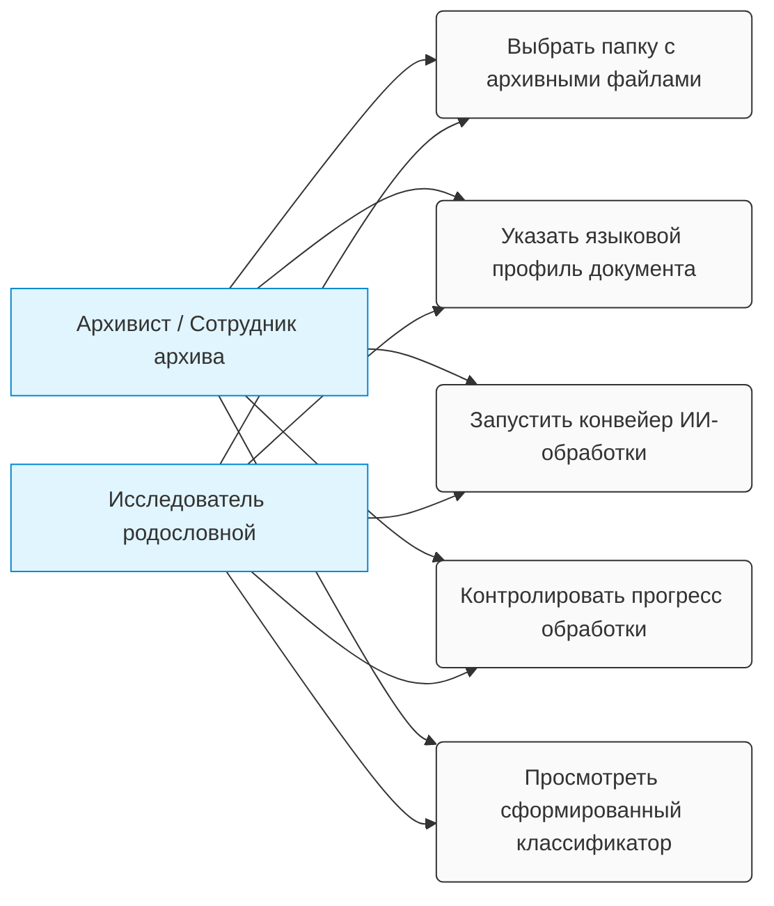

## 🗺️ Карта вариантов использования (Use Case Diagram)

Ниже представлена диаграмма, визуализирующая границы системы и основные сценарии взаимодействия конечных пользователей с приложением `AI Document Indexer`:

---

# Пользовательские истории (User Stories) и критерии приёмки

В данном документе зафиксированы функциональные требования к системе `AI Document Indexer` со стороны конечного пользователя (архивиста / исследователя родословной).

---

## 👥 Бэклог пользовательских историй (User Stories)

### 1. Авторизация и старт работы
* **История:** Я как исследователь, хочу войти в программу, чтобы она помогла мне сформировать классификаторы для поиска информации.
* **Критерии приёмки (AC):**
  - **AC 1.1:** При запуске приложения открывается главный экран с понятным интерфейсом.
  - **AC 1.2:** Система предоставляет краткую инструкцию или приветственное окно для начала работы.

### 2. Выбор источника данных
* **История:** Я как исследователь, хочу выбрать папку на локальном компьютере, чтобы указать системе, где лежат мои исходные графические документы.
* **Критерии приёмки (AC):**
  - **AC 2.1:** В интерфейсе доступна кнопка «Обзор»/«Выбрать папку» для вызова стандартного диалогового окна ОС.
  - **AC 2.2:** После выбора папки система отображает полный путь к ней на экране.

### 3. Настройка параметров поиска (Оптимизация)
* **История:** Я как исследователь, хочу настроить программу (указать расширения файлов, тип и эпоху документа), чтобы оптимизировать запросы к ИИ и снизить затраты на поиск.
* **Критерии приёмки (AC):**
  - **AC 3.1:** Доступен выбор расширений файлов (чекбоксы или список: `.jpg`, `.png`, `.tiff`).
  - **AC 3.2:** Доступен выбор языкового профиля эпохи (`ru-old` для дореволюционных документов, `ru-modern` для советских и современных).

### 4. Мониторинг прогресса обработки
* **История:** Я как исследователь, хочу понимать текущее состояние обработки данных (какой файл обрабатывается в данный момент) и остаток времени, чтобы я мог заняться другими задачами во время работы конвейера.
* **Критерии приёмки (AC):**
  - **AC 4.1:** Отображается графический прогресс-бар в процентах (0–100%).
  - **AC 4.2:** Выводится имя текущего обрабатываемого файла и текстовый счетчик (например, *«Обработано 15 из 120 файлов»*).
  - **AC 4.3:** Система рассчитывает и выводит ориентировочное время до окончания процесса (ETA).

### 5. Контроль и разбор ошибок
* **История:** Я как исследователь, хочу увидеть ошибки обработки документов, чтобы иметь возможность их проигнорировать, исправить или отложить для последующего ручного разбора глазами.
* **Критерии приёмки (AC):**
  - **AC 5.1:** Поврежденные или нечитаемые файлы не прерывают работу всей программы.
  - **AC 5.2:** В конце сессии формируется наглядный список проблемных файлов с указанием путей к ним и причины ошибки (например, *«Не удалось прочитать изображение»*).

### 6. Обновление программного обеспечения
* **История:** Я как исследователь, хочу иметь возможность легко обновить программу из дистрибутива при выходе новой версии, чтобы максимально использовать новые возможности и исправления.
* **Критерии приёмки (AC):**
  - **AC 6.1:** Программа предоставляет понятный механизм обновления (например, установщик поверх старой версии без потери локальных настроек).

### 7. Экспорт и сохранение классификатора
* **История:** Я как исследователь, хочу иметь возможность сохранить итоговый сформированный классификатор на компьютер в выбранную мной папку для последующей обработки.
* **Критерии приёмки (AC):**
  - **AC 7.1:** Доступна кнопка «Экспорт / Сохранить результат».
  - **AC 7.2:** Система позволяет пользователю через диалоговое окно выбрать целевую папку и имя сохраняемого файла.
 
---
